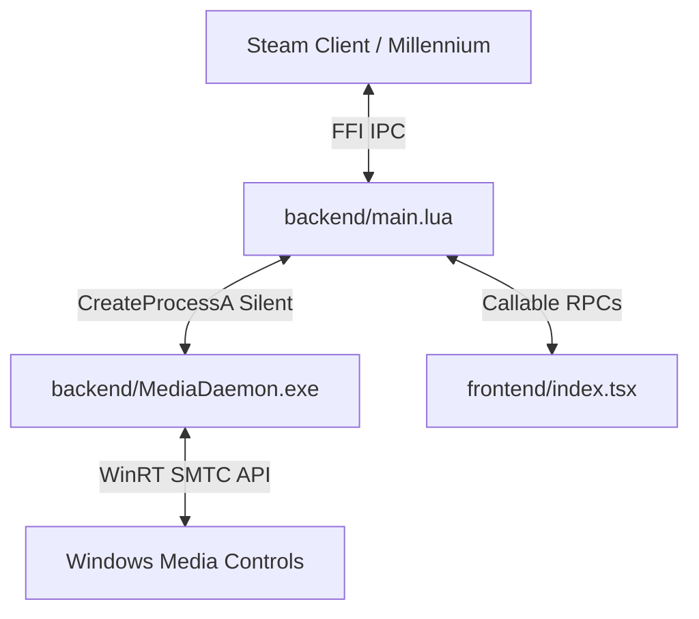

# Spotify & Windows Media Notifications for Steam

A high-performance Millennium plugin that integrates Spotify and Windows System Media Transport Controls (SMTC) with Steam, showing gorgeous notifications whenever a new song starts playing.

> [!TIP]
> **New in Version 2.0**: The plugin now features a native C# background daemon that listens directly to Windows media events with zero lag, zero annoying popup console windows, <12MB RAM consumption, and absolutely **no Spotify developer account or authentication required!**

---

## 🎵 Features

- 🖥️ **Universal Windows Media Support (New!)**: Natively integrates with Windows 10/11 System Media Transport Controls (SMTC). Works instantly with Spotify (Desktop/Web), YouTube, VLC, and any media player that integrates with Windows.
- ⚡ **Lightweight & Silent**: The event-driven C# background daemon uses WinRT events, consuming `< 12MB RAM` and `0% CPU` at rest. Starts **100% windowlessly and silently** via LuaJIT FFI `CreateProcessA` (no annoying command prompt flash).
- 🔌 **Dual Mode Support**:
  - **Windows Media Mode (Recommended)**: Plug-and-play. Grabs active media details directly from Windows with base64 album artwork.
  - **Spotify Playback & Web API Modes**: Legacy modes that support connecting directly to Spotify's APIs (with automatic token refreshing and OAuth).
- 🎨 **Rich Notifications**: Displays album artwork, artist names, song titles, and playback status directly in Steam's native notification system.
- 🌐 **Multilingual Support (New!)**: Dynamically localizes all settings panels, tooltips, playback control labels, and notifications in **English, Spanish, and Portuguese** depending on the Steam Client's active language.
- ⚙️ **Steam Native Control Panel**: Access the settings interface directly via the Millennium settings inside Steam to select your preferred media source and adjust notification preferences.

---

## 📋 Prerequisites

- **[Millennium](https://github.com/SteamClientHomebrew/Millennium)** - Steam client modification framework.
- **Windows 10 or 11**
- **.NET 9 Runtime** (Required to run the high-performance media daemon).
- *(Optional - Legacy)* Python 3.7+ (Only if you intend to run the legacy Spotify Playback API local server).

---

## 🚀 Installation & Setup

### 1. Install the Plugin

Clone this repository directly into your Millennium plugins directory:

```powershell
# Navigate to your Millennium plugins folder (e.g., C:\Program Files (x86)\Steam\plugins)
git clone https://github.com/yourusername/spotify-notifications-steam.git

# Install dependencies and build the plugin frontend
cd spotify-notifications-steam
pnpm install
pnpm run build
```

### 2. Enable in Steam

1. Start Steam with Millennium active.
2. Go to Millennium settings -> **Plugins** and enable **Spotify & Windows Media Notifications**.
3. Click the settings/configuration button next to the plugin in Millennium to open the control panel.
4. Select **Windows Media** as your source mode to enjoy instant, configuration-free notifications for Spotify and any other media player!

---

## 🛠️ Legacy Spotify API Configuration (Optional)

If you prefer to connect directly to the Spotify Web API instead of using the local Windows Media daemon:

### Option A: Local Playback API Server

This method connects to a local playback API server running on your machine. You can use either:
- 🐍 **Python Version**: The [spotify-playback-http (less-compat-version)](https://github.com/CrazyKitty357/spotify-playback-http/tree/less-compat-version) server. You can automatically configure and run it with:
  ```powershell
  python setup_playback_server.py
  ```
- 🦀 **Rust Version (Highly Recommended Reimplementation)**: The ultra-fast, lightweight [spotify-server](https://github.com/eme22/spotify-server) reimplementation, which runs natively with minimal footprint.


### Option B: Official Spotify Web API (Requires Auth & Premium)
1. Go to the [Spotify Developer Dashboard](https://developer.spotify.com/dashboard/applications) and create an app.
2. Set the **Redirect URI** to `http://localhost:8888/callback`.
3. Open the plugin **Control Panel** via the Millennium settings in Steam.
4. Select **Spotify Web API** as your connection mode.
5. Enter your **Client ID** and **Client Secret** directly into the settings fields, click **Authenticate**, and paste the callback URL/code to exchange it.
6. Click **Save Settings**! (For detailed step-by-step instructions, see [SPOTIFY_SETUP.md](file:///c:/Users/MSB19/Downloads/spotify-notifications-steam/SPOTIFY_SETUP.md)).

---

## 🏗️ Architecture



- **Millennium Frontend (`frontend/`)**: Renders the Steam UI Control Panel, polls track information, and invokes native Steam notifications.
- **Millennium Backend (`backend/main.lua`)**: Launches the `MediaDaemon.exe` completely silently (using LuaJIT FFI `CreateProcessA` with `CREATE_NO_WINDOW`) and acts as the bridge for frontend RPC calls.
- **Media Daemon (`backend/MediaDaemon.exe`)**: A high-efficiency .NET 9 executable that registers native event listeners on Windows GlobalSystemMediaTransportControlsSessionManager, saving active track state updates to `media_state.json` and taking playback commands from `media_command.txt`.

---

## 🔌 API Reference

### Frontend → Backend (Lua Calls)
* **`get_windows_media()`**: Reads `media_state.json` and returns the active track metadata (title, artist, album, progress, duration, and base64-encoded thumbnail).
* **`control_windows_media(command)`**: Writes a playback control action (e.g. `play`, `pause`, `next`, `previous`, or `stop`) to `media_command.txt` for the C# daemon to execute.

---

## ⚙️ Development

If you wish to make changes to the C# daemon or build from source:

```powershell
# Open backend/MediaDaemon subproject
cd backend/MediaDaemon

# Build release binary
dotnet build -c Release
```

The compiled binary will be placed inside the `backend/` directory as `MediaDaemon.exe`.

---

## 📄 License

This project is licensed under the MIT License. See [LICENSE](LICENSE) for more details.

## 🤝 Credits

- Built for the **[Millennium](https://github.com/SteamClientHomebrew/Millennium)** homebrew Steam framework.
- Inspired by the need for a modern, battery-efficient, and elegant media companion inside Steam.

---

## 💖 Support the Project / Apoya el Proyecto

If you love this plugin and want to support its active development, performance improvements, and new features, consider supporting me on Patreon!

[](https://www.patreon.com/c/eme22)

Your support helps keep this and other Steam/Millennium open-source projects actively maintained and updated!